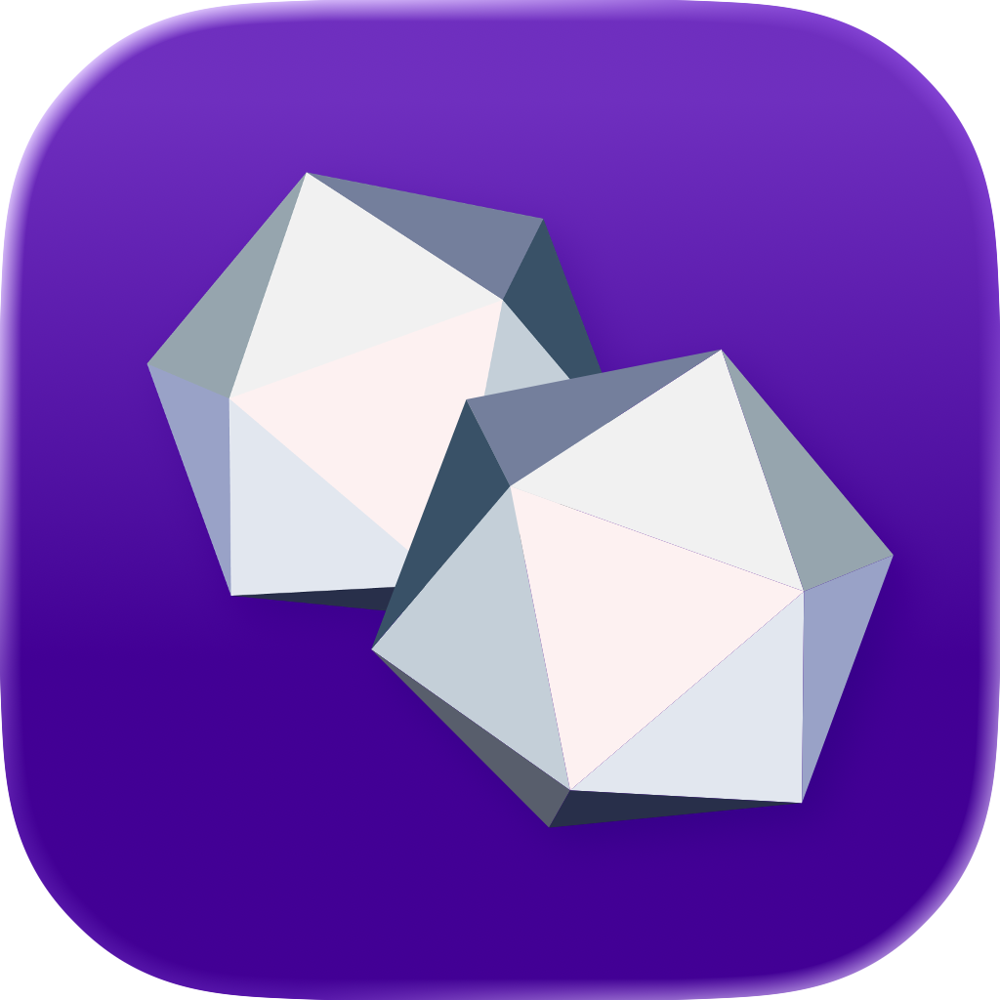

# Initiative iOS app

### 🇧🇷 Documentos Legais
[EULA (pt)](https://raw.githubusercontent.com/initiative-app/iOS/main/EULA-pt.pdf)

[Política de Privacidade (pt)](https://raw.githubusercontent.com/initiative-app/iOS/main/poli%CC%81tica-de-privacidade.pdf)

### 🇺🇸 Legal Documents
[EULA (en)](https://raw.githubusercontent.com/initiative-app/iOS/main/EULA-en.pdf)

[Privacy Policy (en)](https://raw.githubusercontent.com/initiative-app/iOS/main/privacy-policy.pdf)

#

### 🇧🇷 Sobre o App
A Initiative foi criada para auxiliar e aprimorar a experiência de jogo de RPG de mesa por meio de missões narrativas personalizadas e acompanhamento visual das sessões, com o objetivo de reforçar o senso de cooperação e explorar conexões emocionais significativas para manter o engajamento, mesmo com longos períodos entre as sessões.
Atualmente, você pode:
- Criar campanhas e adicionar jogadores ao grupo;
- Adicionar informações básicas sobre a campanha;
- Enviar missões como uma forma de reacender a chama da campanha nos jogadores.
- Com elas, é possível rolar dados que podem influenciar ações em sessões futuras (revelando ou não as consequências no momento), enviar mensagens como o seu personagem (relembrando interações ocorridas no passado, por exemplo) e oferecer aos jogadores escolhas a serem feitas com base em seus personagens.
- Como mestre de jogo, isso permite obter feedback dos membros do grupo, incluir novas informações de lore, vilões à espreita dos jogadores ou até revelar segredos.
- Interagir com as missões enviadas
- Alterar temas do aplicativo para aumentar a imersão conforme a campanha em andamento.

AO INSTALAR, ACESSAR OU UTILIZAR O APLICATIVO, VOCÊ RECONHECE QUE LEU, COMPREENDEU E CONCORDA EM FICAR VINCULADO AOS TERMOS DO EULA E À POLÍTICA DE PRIVACIDADE.

#

### 🇺🇸 About the App
Initiative was created to assist and enhance the tabletop RPG experience through personalized narrative missions and visual session tracking, aiming to reinforce the sense of cooperation and explore meaningful emotional connections that help maintain engagement—even during long breaks between sessions.
Currently, you can:
- Create campaigns and add players to the party;
- Add basic information about the campaign;
- Send missions as a way to rekindle the campaign’s spark for players;
- Use missions to roll dice that may influence actions in future sessions (whether or not their consequences are revealed at the time), send messages as your character (such as recalling past interactions), and offer players choices based on their characters;
- As the game master, collect feedback from party members, add new lore details, introduce villains lurking in the shadows, or even reveal secrets;
- Interact with the missions you send;
- Change the app’s themes to increase immersion according to the ongoing campaign.

BY INSTALLING, ACCESSING, OR USING THE APPLICATION, YOU ACKNOWLEDGE THAT YOU HAVE READ, UNDERSTOOD, AND AGREE TO BE BOUND BY THE EULA AND THE PRIVACY POLICY.

#

## 🇧🇷 Sobre este Repositório
Este repositório contém os documentos legais públicos (EULA e Política de Privacidade) do aplicativo Initiative para iOS.  
Nenhum código-fonte é armazenado aqui.

## 🇺🇸 About this Repository
This repository hosts the public legal documents (EULA and Privacy Policy) for the Initiative iOS application.  
No source code is stored here.
